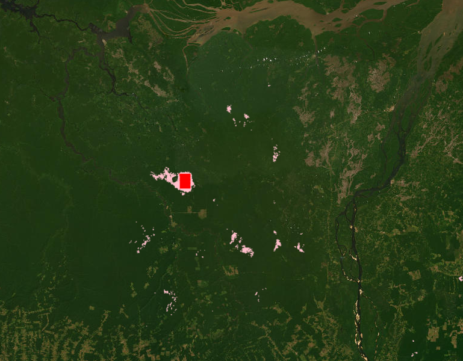

The nature-based carbon credits industry has yet to gain significant trust.
There are numerous instances where landowners claim they would deforest land they never intended to clear in order to secure carbon offsets.
To address this issue, it is crucial to assess the likelihood of deforestation for lands claimed to be protected, particularly in rainforests.

I worked on a project aimed at detecting similar forest patches to determine the effectiveness of claimed protections.
By observing deforestation in similar lands and comparing that with the protected forest, we can better validate the protection claims.
The approach utilized satellite and land use data to calculate an N-dimensional feature vector for each pixel in the satellite imagery, representing factors influencing forest growth and deforestation (GPP, terrain slope, distance from road, water, and farmland).

For each pixel within the protected project area, I identified a matching control point within a 100km radius.
The matching process involved a Nearest Neighbor search in the feature space, with all features equally weighted.
Each pixel in the protect land was matched to a unique control pixel outside the protected lands, minimizing the sum distance of each match to find the best overall set of control points.

In the image below, the red rectangle indicates the protected land, while the light pink areas represent similar forest patches that we should observe for deforestation.

